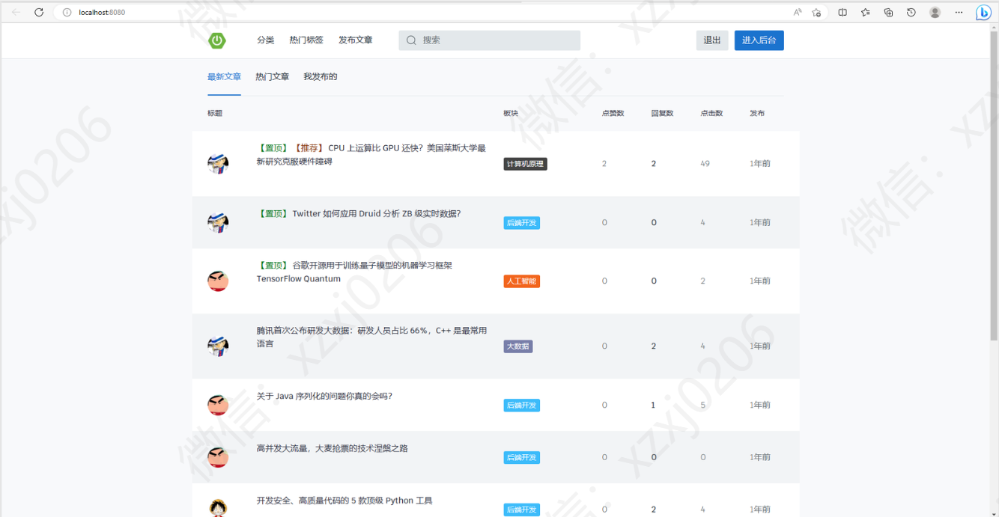
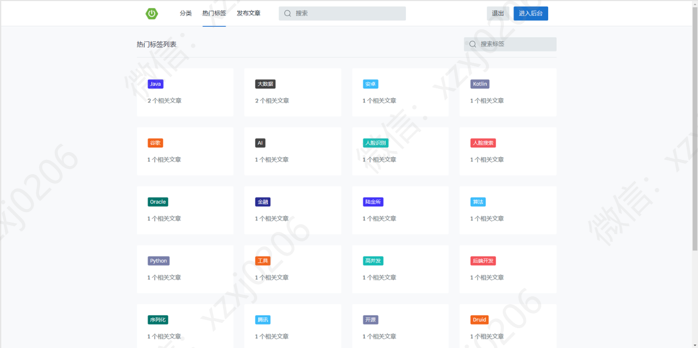
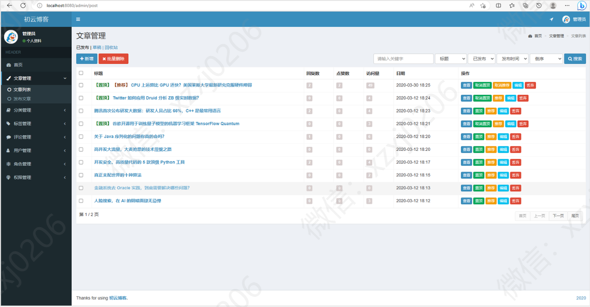
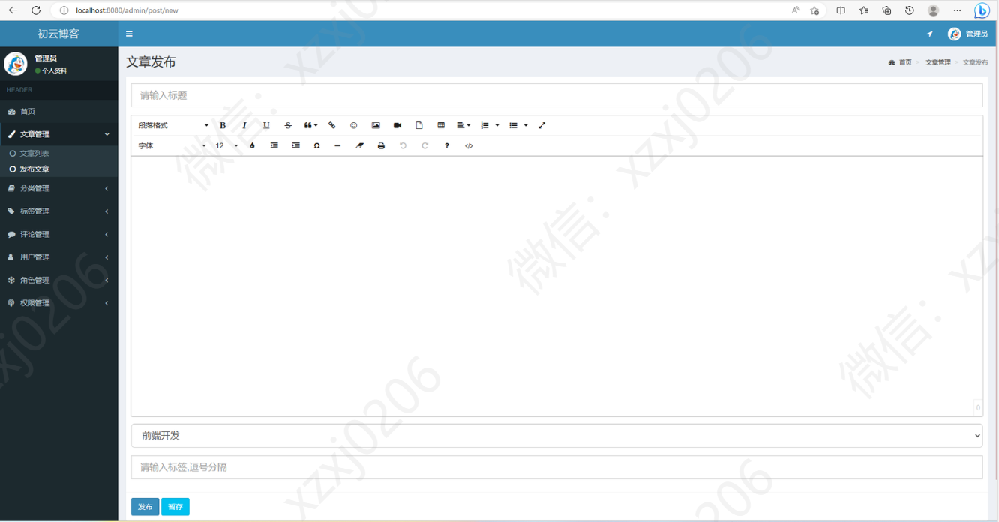
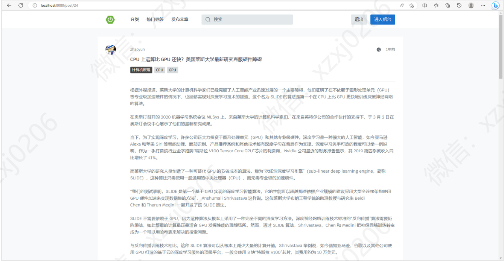
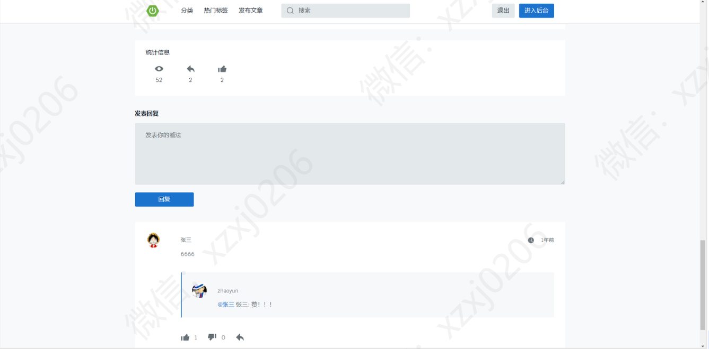

# 博客系统

### 一、项目介绍

语言：java

运行工具：idea或eclipse vscode 数据库：mysql

基于SpringBoot MyBatis JQuery html实现的博客网站

博客网站 

三个角色：游客 用户 管理员

游客可以浏览文章， 游客可以登录注册成用户，发布文章 管理自己的文章，评论和回复，点赞评论回复文章等 

管理员可以对整个系统用户管理，文章管理，分类管理，角色权限管理，评论管理等等

### 完整项目获取

通过网盘分享的文件：个人博客系统

链接: https://pan.baidu.com/s/1mB-aR2_HvxV17xcEJe7Y9A?pwd=u2rz 提取码: u2rz
--来自百度网盘超级会员v3的分享

通过网盘分享的文件：工具包

链接: https://pan.baidu.com/s/1YmdoJvkjoUjA75wvHLDZ6A?pwd=xm96 提取码: xm96
--来自百度网盘超级会员v3的分享

需要远程项目部署或项目修改和毕业设计也可联系（添加申请时请备注好来意）

通过网盘分享的文件：远程调试部署联系方式

链接: https://pan.baidu.com/s/1W0dDcoZmayG0c7USJDYBYg?pwd=nqd7 提取码: nqd7
--来自百度网盘超级会员v3的分享

### 二、系统部分功能界面展示

## 接毕业设计和论文

### 微信联系方式：xzxj0206  QQ：3808981644   (支持修改、 部署调试、 支持代做毕设)

### 接网站建设、小程序、H5、APP、各种系统等，单片机、嵌入式也可以做

### 选题+开题报告+任务书+程序定制+安装调试+论文+答辩ppt  都可以做

项目合集(项目不断更新中)
链接: https://pan.baidu.com/s/1nY-zhvAK0CXYcn3g7LzQnQ?pwd=id3c 提取码: id3c
--来自百度网盘超级会员v3的分享

这些项目一起发你了 可以介绍给需要的同学 调试可找我 也接二次修改和项目定制、毕业设计等